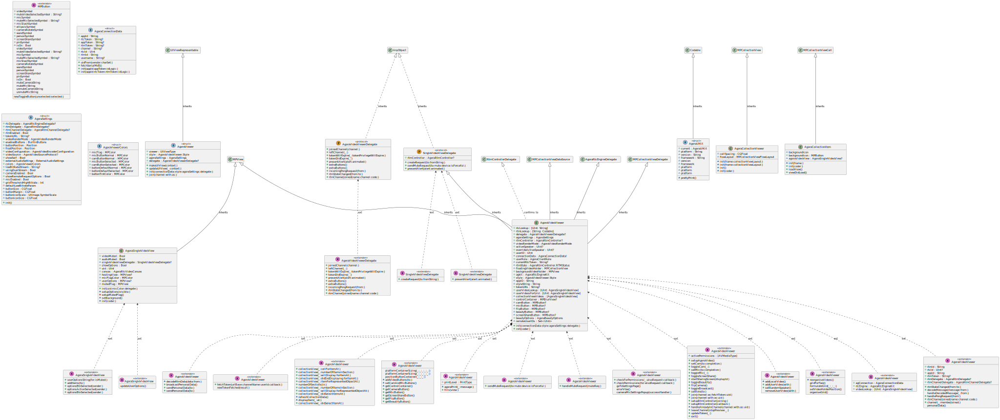
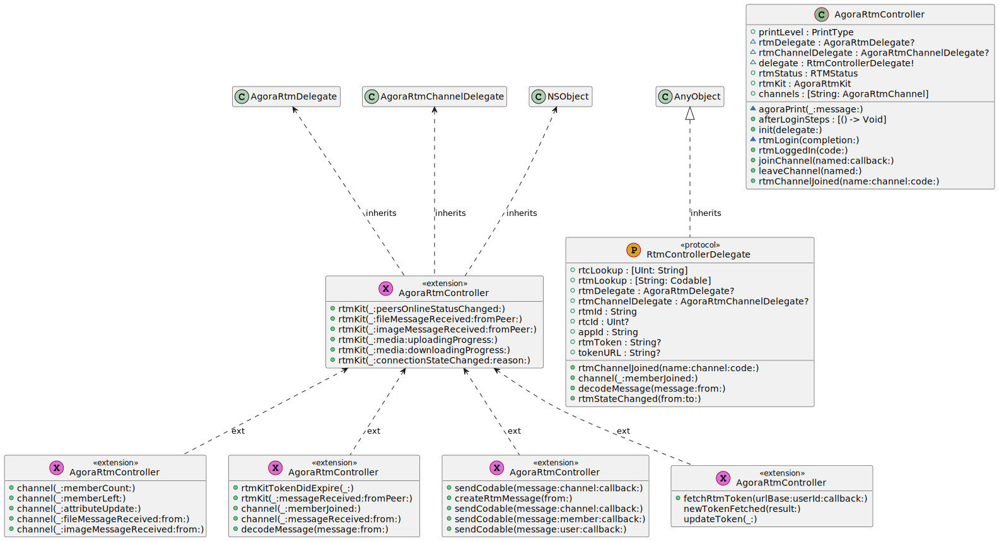

# Agora UIKit for iOS and macOS

<p align="center">
    
    </br>
    
    
    
    <a href="https://www.agora.io/en/join-slack/">
        
    </a>
</p>
Instantly integrate Agora in your own application or prototype using iOS or macOS.

<p align="center">
  
</p>

[More information available on this repo's Wiki](https://github.com/AgoraIO-Community/iOS-UIKit/wiki)

[Click here for full documentation](https://agoraio-community.github.io/iOS-UIKit/)

## Requirements

- iOS 13.0+ or a macOS 10.15 or later
- Xcode 12.3 or later
- CocoaPods (if installing with CocoaPods)
- [An Agora developer account](https://www.agora.io/en/blog/how-to-get-started-with-agora?utm_source=github&utm_repo=agora-ios-uikit)

Once you have an Agora developer account and an App ID, you're ready to use this package.

## Installation

Swift Package Manager and CocoaPods are both available offered for installation methods.

The Pod for this package is called `AgoraUIKit_iOS` and `AgoraUIKit_macOS` for the two available platforms.

See the [Installation wiki](https://github.com/AgoraIO-Community/iOS-UIKit/wiki/Installation) page for more information on installing the package.

## Usage

Once installed, open your application `.xcodeproj` file. Or `.xcworkspace` if using CocoaPods.

The main view for Agora UIKit is `AgoraVideoViewer`. This is an example of a minimal creation that gives you a view similar to the one at the top of this README:

```swift
import AgoraRtcKit
import AgoraUIKit

let agoraView = AgoraVideoViewer(
    connectionData: AgoraConnectionData(
        appId: "<#my-app-id#>",
        rtcToken: "<#my-channel-token#>",
        rtmToken: "<#my-channel-rtm-token#>"
    ), delegate: self
)
```

Frame your newly created AgoraVideoViewer in the app scene, then join a channel by calling:

```swift
agoraView.join(channel: "test", as: .broadcaster)
```

[More examples available on the wiki](https://github.com/AgoraIO-Community/iOS-UIKit/wiki/Examples)

## Documentation

For full documentation, see our [AgoraUIKit documentation page](https://agoraio-community.github.io/iOS-UIKit/).

## Error Handling and Troubleshooting

For tips on how to overcome some common errors, [see the wiki page](https://github.com/AgoraIO-Community/iOS-UIKit/wiki/Error-Handling-and-Troubleshooting).

## Roadmap

- [x] Muting/Unmuting a remote member
- [x] Usernames ([Settable value, not currently rendered](https://agoraio-community.github.io/iOS-UIKit/documentation/agorauikit_ios/agoraconnectiondata/username))
- [ ] Promoting an audience member to a broadcaster role.
- [ ] Layout for Voice Calls
- [ ] Cloud recording

## UIKits

The plan is to grow this library and have similar offerings across all supported platforms. There are already similar libraries for [Android](https://github.com/AgoraIO-Community/Android-UIKit/), [React Native](https://github.com/AgoraIO-Community/ReactNative-UIKit), [Flutter](https://github.com/AgoraIO-Community/Flutter-UIKit/) and [Web React](https://github.com/AgoraIO-Community/Web-React-UIKit) so be sure to check them out.

## UML Diagrams

- AgoraUIKit

<p align="center">
    
</p>

- AgoraRtmControl

<p align="center">
    
</p>

> generated with `swiftplantuml classdiagram Sources`
